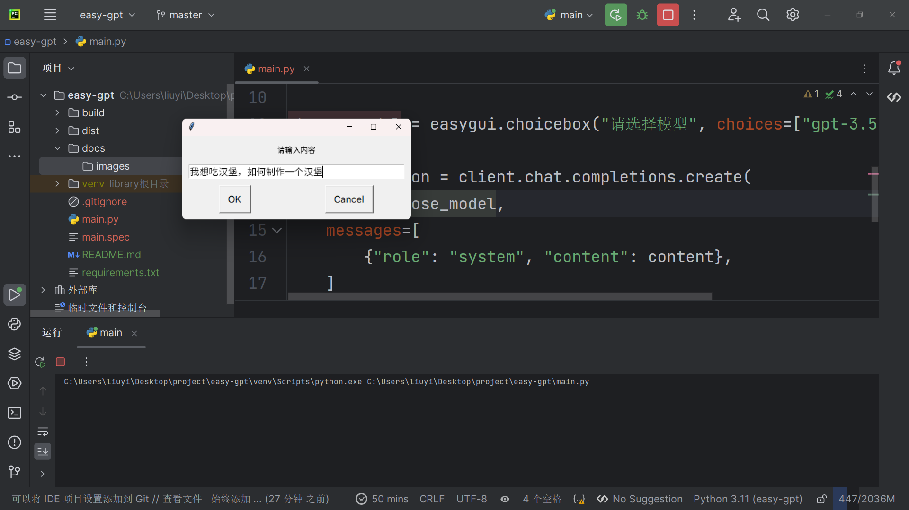
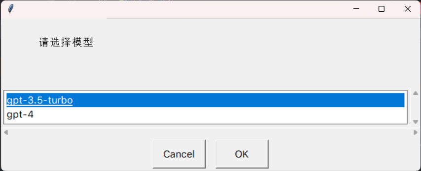
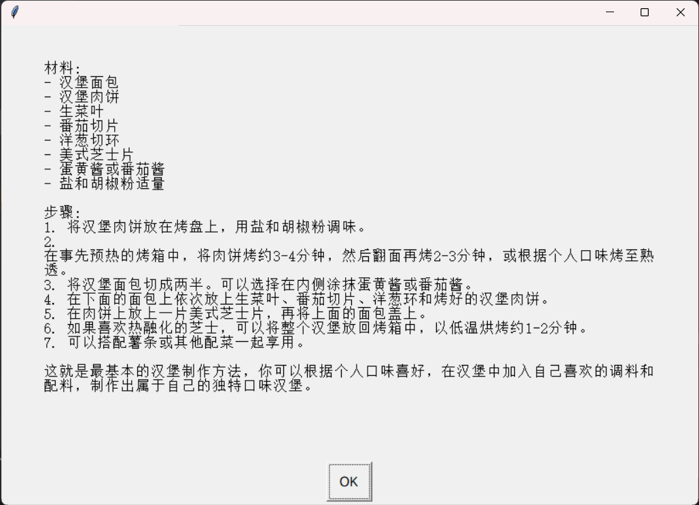

# ✨easy-gpt (轻松的GPT)

一些开源的ChatGPT项目，我们见过网页版ChatGPT，也见过桌面版ChatGPT，但是过于的繁琐设置、让小白们难以使用，easy-gpt 就是为了解决这个问题而生的。

# 🚀快速开始

##   📥下载

```bash
git clone git@github.com:MCheping8108/easy-gpt.git
```

##  📚安装 & 运行

```bash
cd easy-gpt
pip3 install -r requirements.txt
python3 main.py
```

## 📌使用效果






## 🎏未来计划

- [x] 增加更多模型
- [ ] 支持i18n国际化
- [x] 将输出的写入txt
-  [ ] 摆脱easygui依赖